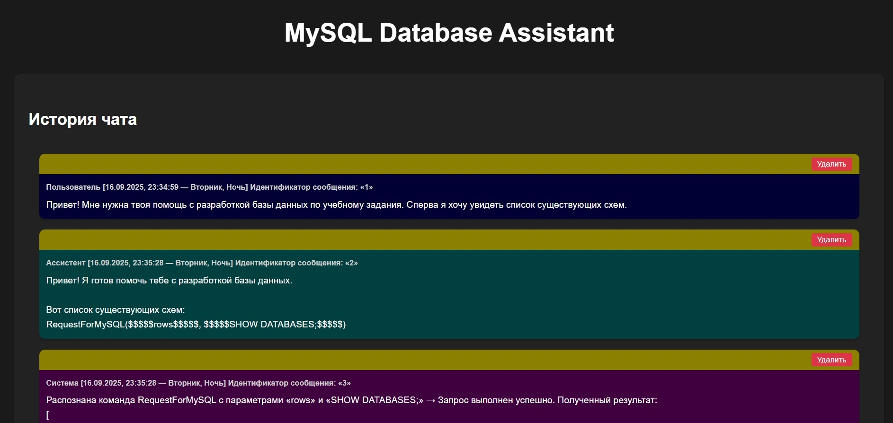
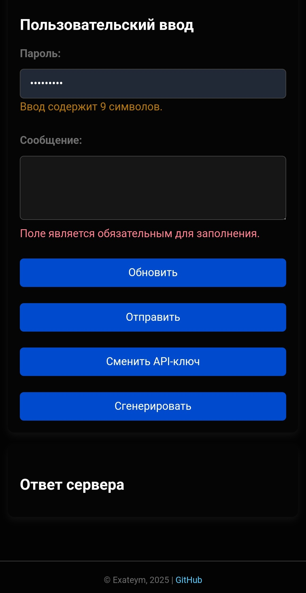

# MySQL Database Assistant

Проект представляет собой **чат-бот приложение**, в котором участвуют три роли: ассистент, пользователь и система. Свою реализацию получил как кроссплатформенная и межсетевая программа, где серверная часть отделена от клиентской стороны, представляющей собой веб-страницу в браузере. Процесс кропотливой разработки пережил множество рефакторингов, благодаря которым можно гибко и легко модифицировать функционал. Общение с выбранной языковой моделью и взаимодействие с реальной базой данных **помогут в интерактивном диалоговом режиме изучать SQL-запросы**.





Наиболее интересной особенностью приложения стала **разработка парсера текста**. Алгоритм распознаёт прописанные в системе команды, извлекает аргументы, если они требуются, и вызывает соответствующие функции-обработчики. Не любая языковая модель имеет встроенную возможность работать с внешними инструментами через общепринятую схему передачи данных. Достижение универсальности благодаря более приземлённому способу через разбор сообщения на подстроки гарантирует доступность как для искусственного интеллекта, так и для пользователя чата. *(Если вас интересует разбор работы алгоритма парсера команд, более глубокое понимание принципов [рассматривается на простом примере](demonstrative_material/step-by-step_message_processing.md)).*

## 📒 Руководство по установке

С использованием не должно возникнуть никаких проблем — программа сделана **максимально отзывчивой** и уточняет, почему именно возникают ошибки. Также прошу заметить, что проект разрабатывался на Windows, но может быть запущен и на другой операционной системе. *(Если требуется запуск на Android, рекомендую попробовать [вот такой гайд](https://habr.com/ru/articles/301442)).*

1. Прежде чем начать, необходимо скачать или клонировать репозиторий. *(Зелёная кнопка [<> Code ↓] сверху).*

2. Далее следует убедиться о наличии **Node.js**. Откройте терминал и введите `node -v`. Если версия не обнаружена, необходимо **[перейти на сайт](https://nodejs.org)**, чтобы скачать и затем установить эту среду выполнения, в которой работает приложение.

3. Загрузить все необходимые модули можно либо через консоль, открытую в расположении каталога проекта, если ввести `npm install`, либо через запуск `install_dependencies.cmd`.

4. Запустить главный файл `server.js` можно либо через консольный терминал, введя `node server.js`, либо воспользовавшись `launch.vbs`.

## ⚙ Конфигурация проекта

Если у вас отсутствует файл `configuration.json`, то при старте программы будет создан его шаблон для дальнейшего заполнения:

```json
{
	"webServer": {
		"port": 3000,
		"password": ""
	},
	"usedApi": {
		"name": "",
		"model": "",
		"tokensLimit": 0,
		"provideMetadata": true
	},
	"mysqlServer": {
		"host": "localhost",
		"port": 3306,
		"user": "root",
		"password": ""
	}
}
```

- Настройки `webServer` служат ради интерфейса приложения: порт позволяет загрузить веб-страницу, а пароль защищет сервер при любом запросе от клиентской части.

- Структура `usedApi` описывает, через какой сервис будет использоваться подключение ассистента. Для поля `name` доступны лишь два варианта: `Google AI Studio` и `OpenRouter`. Значение `tokensLimit` влияет на объём актуального контекста, отправляемого искусственному интеллекту. Для извлечения наибольшей выгоды разумно перекопировать сюда указанный провайдером токеновый лимит. Тем не менее, можно ограничиться выставленным вручную пределом, который будет меньше максимального. Последнее свойство `provideMetadata` говорит программе, требуется ли предоставлять языковой модели следующие сведения: текущее время, идентификаторы и даты отправки по каждому сообщению из истории чата.

- Данные `mysqlServer` требуются для передачи при использовании пула запросов к серверу MySQL.

## 🤖 Виртуальный помощник

Файл по расположению `api_keys/list.json` имеет важный замысел **ротации API-ключей**, если они были созданы с разных аккаунтов. Важно понимать, что бесплатные средства могут истратиться весьма быстро, что напрямую зависит от выбранного провайдера. Например, для `OpenRouter` этот список мог бы выглядеть следующим образом:

```json
[
	"sk-or-v1-ПЕРВЫЙ",
	"sk-or-v1-ВТОРОЙ",
	"sk-or-v1-ТРЕТИЙ"
]
```

Ниже пойдёт речь про API, через которое приложение делает запросы и получает ответы искусственного интеллекта. *(Рассказанное можно считать актуальным лишь на момент написания этого текста. Все суждения исходят из личного опыта использования).*

### Google AI Studio

Пожалуй, **лучший вариант из бесплатных** — `gemini-2.5-flash`. Вы получите качественно сформированные и обдуманные ответы, при этом не придётся бороться в очереди или думать про ежедневное ограничение по числу запросов. К сожалению, существует нюанс — **запрет на регионы**, однако проблема имеет своё решение.

Это не реклама, поэтому стоит воспринимать лишь как совет. Рекомендую использовать **[Windscribe](https://windscribe.com/download)** — за уйму часов использования ни разу не разочаровался. Бесплатно и к тому же есть функция раздельного туннелирования, где можно указать приложения, на которые будет влиять подключение VPN. Таким образом, необходимо будет указать путь до Node.js, который может выглядеть так: `C:\Program Files\nodejs\node.exe`, а также путь до браузера, чтобы можно было попасть в Google AI Studio.

Теперь, когда применение VPN оговорено, можно свободно продолжить дальше. Итак, на этом шаге требуется перейти в **[Google AI Studio](https://aistudio.google.com)**. Естественно, необходим вход в аккаунт Google, прежде чем продолжить. На сайте есть кнопка **Get API key**, переход по которой приведёт к возможности создать свой ключ. После создания **необходимо сохранить ключ**, ведь сайт больше не покажет его в полную длину из-за целей безопасности использования.

### OpenRouter

Альтернативный вариант — поиск подходящего провайдера и языковой модели среди огромного множества. Здесь не возникнет проблемы запрета на регионы, но вот насчёт лимита по числу запросов можно возразить: бесплатный план действительно закончится гораздо быстрее, чем в первом случае. Именно ради избежания таких неудобств была добавлена **возможность переключаться по вашему списку API-ключей**. Для выбора ассистента могу порекомендовать `deepseek/deepseek-chat-v3.1:free` и `tngtech/deepseek-r1t-chimera:free` — достойное сочетание интеллекта и доступности.

## ⚖️ Лицензирование

Проект распространяется на условиях лицензии [MIT](LICENSE).